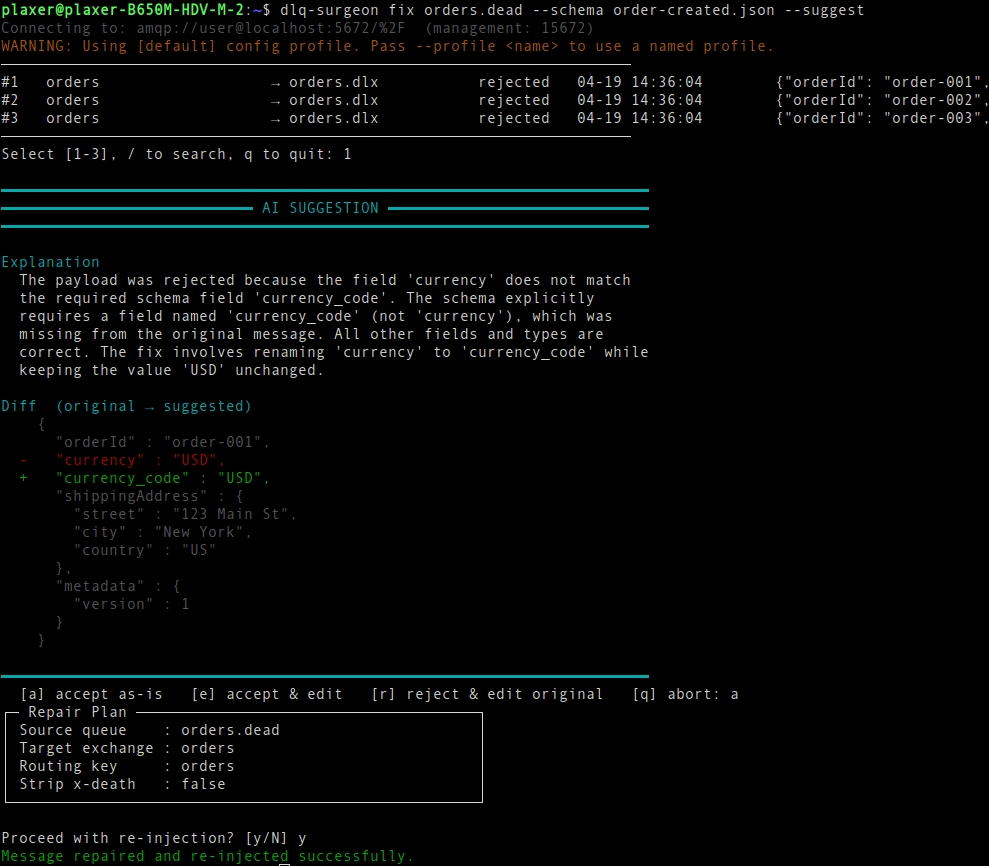

# DLQ-Surgeon

A CLI tool for repairing and re-injecting messages from RabbitMQ Dead Letter Queues. Fetch a message, edit the payload (or let an LLM propose the fix from your JSON Schema), optionally validate, then re-publish it to the original exchange. The source message is deleted only after a publisher confirm is received - if anything fails, nothing is touched.

<p align="center">
  
</p>

---

## The Problem

RabbitMQ's Dead Letter Exchanges do their job, but most messages in DLQs fail for recoverable reasons:

- A field was renamed in a deploy (`currency` → `currency_code`)
- A frontend bug sent `shippingAddress` as a string instead of an object
- A new required field (`metadata.version`) appeared after a schema migration
- A transient Redis blip dead-lettered 400 perfectly valid inventory updates

The usual approach is to copy the payload from the Management UI, edit it locally, manually reconstruct the original exchange and routing key, and republish with curl. One typo can mean a lost message or duplicate processing.

DLQ-surgeon was made to fill every gap in that loop, now with AI assistance.

---

## Install

**One-liner (Linux x86_64, installs to `~/.local/bin`):**

```bash
curl -fsSL https://github.com/plaaxer/dlq-surgeon/releases/latest/download/install.sh | sh
```

Pin to a specific release:

```bash
curl -fsSL https://github.com/plaaxer/dlq-surgeon/releases/download/v1.0.0/install.sh \
  | sh -s -- --version v1.0.0
```

Install system-wide instead:

```bash
curl -fsSL https://github.com/plaaxer/dlq-surgeon/releases/latest/download/install.sh \
  | sudo sh -s -- --prefix /usr/local/bin
```

If `~/.local/bin` isn't on your `$PATH`, the script prints the line to add to your shell rc.

> **Bleeding-edge installer (track master):** if a release ships with a broken installer and a fix has landed on master, you can bypass the release asset:
> ```bash
> curl -fsSL https://raw.githubusercontent.com/plaaxer/dlq-surgeon/master/install.sh | sh
> ```

**Manual:** download the `dlq-surgeon` binary or `dlq-surgeon-fat.jar` from the [releases page](../../releases) and `chmod +x` the binary.

---

## Quick Start

**Usage:**

```
dlq-surgeon [--profile <name>] <command> [<queue>] [--host <host>] [--user <user>] [--password <password>] [options]
```

Against a local RabbitMQ with default credentials (`guest`/`guest` on `localhost`), no flags are needed:

```bash
./dlq-surgeon list
./dlq-surgeon peek orders.dlq
./dlq-surgeon fix orders.dlq
```

Against a remote host:

```bash
# See all queues (message counts, DLX flag)
./dlq-surgeon list --host rabbitmq.prod.internal --user admin --password s3cr3t

# Inspect messages without touching anything
./dlq-surgeon peek orders.dlq --host rabbitmq.prod.internal --user admin --password s3cr3t

# Repair and re-inject, with schema validation
./dlq-surgeon fix orders.dlq \
  --host rabbitmq.prod.internal \
  --user admin \
  --password s3cr3t \
  --schema ./schemas/order-created.json
```

`fix` will:
1. Fetch messages from the DLQ (held in memory only)
2. Show an interactive picker — select the message to repair
3. **If `--suggest`:** ask the configured LLM for a repaired payload, show a diff, and prompt for `a` / `e` / `r` / `q` (see below)
4. Open the payload in your `$EDITOR` (skipped on "accept as-is")
5. Validate the edited payload against the JSON Schema (if `--schema` is given)
6. Show the full repair plan and ask for confirmation
7. Publish to the original exchange + routing key (read from `x-death` headers)
8. Wait for a publisher confirm from the broker
9. **Only then** delete the message from the DLQ

---

## AI-Assisted Repair

Pass `--suggest` to have an LLM read the dead-lettered payload plus your JSON Schema and propose a repaired version. You review a unified diff and pick:

- **`[a]` accept as-is** — publish the suggestion verbatim, skip the editor
- **`[e]` accept & edit** — open the suggestion in `$EDITOR` for final tweaks
- **`[r]` reject** — edit the original payload yourself
- **`[q]` abort** — change nothing

```bash
dlq-surgeon fix orders.dlq --suggest --schema ./schemas/order-created.json
```

The suggestion is always shown for human review — nothing is republished without your confirmation, and the standard repair-plan prompt still runs at the end. `--suggest` works best paired with `--schema`; the model uses the schema as the source of truth for the expected payload shape.

### Providers

Four providers supported via [langchain4j](https://github.com/langchain4j/langchain4j). Set one in `~/.dlq-surgeon/config.toml` (shared across all profiles):

```toml
[ai]
provider = "anthropic"           # anthropic | openai | gemini | ollama
api_key  = "sk-ant-..."
model    = "claude-sonnet-4-6"   # optional — sensible default per provider
```

| Provider | Default model | API key env var | Notes |
|---|---|---|---|
| `anthropic` | `claude-sonnet-4-6` | `ANTHROPIC_API_KEY` | default |
| `openai` | `gpt-4o` | `OPENAI_API_KEY` | set `base_url` for OpenAI-compatible endpoints (vLLM, LM Studio) |
| `gemini` | `gemini-2.0-flash` | `GEMINI_API_KEY` | |
| `ollama` | `llama3.2` | — | local; `base_url` defaults to `http://localhost:11434` |

`chmod 600 ~/.dlq-surgeon/config.toml` if it holds an API key. Env vars still work as fallback (see [`.env.example`](./.env.example)).

---

## Build from Source

```bash
# Fat JAR (requires Java 21+, no GraalVM needed)
mvn package
java -jar target/dlq-surgeon-fat.jar --help

# Native binary (requires GraalVM 21 with native-image)
mvn -Pnative package
./target/dlq-surgeon --help
```

---

## Connection Options

Resolution order (highest to lowest priority): CLI flag → config file → env var → built-in default.

| Flag | Env var | Default |
|---|---|---|
| `--profile` | — | `default` |
| `--host` | `RABBITMQ_HOST` | `localhost` |
| `--management-port` | `RABBITMQ_MANAGEMENT_PORT` | `15672` |
| `--amqp-port` | `RABBITMQ_AMQP_PORT` | `5672` |
| `--vhost` | `RABBITMQ_VHOST` | `/` |
| `--user` | `RABBITMQ_USER` | `guest` |
| `--password` | `RABBITMQ_PASSWORD` | `guest` |
| `--read-only` | — | `false` |

### Config file

Create `~/.dlq-surgeon/config.toml` with named profiles:

```toml
[default]
host     = "localhost"
user     = "guest"
password = "guest"

[prod]
host     = "rabbitmq.prod.internal"
user     = "admin"
password = "s3cr3t"
vhost    = "orders"

[staging]
host     = "rabbitmq.staging.internal"
user     = "admin"
password = "stagingsecret"

[ai]
provider = "anthropic"                 # anthropic | openai | gemini | ollama
api_key  = "sk-ant-..."
model    = "claude-sonnet-4-6"         # optional; sensible default per provider
base_url = "http://localhost:11434"    # only needed for ollama / custom endpoints
```

Then just:

```bash
dlq-surgeon fix orders.dlq                    # uses [default]
dlq-surgeon --profile prod fix orders.dlq     # uses [prod]
```

Any flag passed explicitly on the CLI overrides the config file value.

The `[ai]` section is shared across all profiles. Resolution order: `[ai]` key → matching env var (`DLQ_AI_PROVIDER`, `ANTHROPIC_API_KEY` / `OPENAI_API_KEY` / `GEMINI_API_KEY` / `DLQ_AI_API_KEY`, `DLQ_AI_MODEL`, `DLQ_AI_BASE_URL`) → built-in default. `chmod 600 ~/.dlq-surgeon/config.toml` if it holds an API key.

---

## Re-injection Target: How x-death Is Used

When a message is dead-lettered, RabbitMQ **prepends** an entry to the `x-death` header array — so **index 0 is always the most recent death**. Each entry records:

- `exchange` — the source exchange the message was originally published to (not the DLX)
- `routing-keys` — the routing keys used at that time
- `queue` — the queue where it died
- `reason` — `rejected`, `expired`, `maxlen`, or `delivery-limit`
- `count` — how many times it died in this queue/exchange combination

`fix` reads `x-death[0]` to determine where to re-inject. For a message that died twice in two different queues, the most recent queue's exchange and routing key are used. Use `--target-exchange` and `--target-routing-key` to override if needed.

---

## JSON Schema Validation

Pass `--schema` with a path to a JSON Schema file (Draft-04 through 2020-12):

```bash
dlq-surgeon fix orders.dead --schema ./schemas/order-created.json
```

If the edited payload fails validation, you'll be shown the errors and offered a chance to re-open the editor before the repair is abandoned or retried.

---

## Safety Notes

- **`--read-only`** disables all write operations. `list` and `peek` always work; `fix` exits immediately.
- **`--yes` / `-y`** skips confirmation prompts — useful in automation but use carefully.
- **`--strip-death-headers`** removes `x-death` and `x-first-death-*` headers before re-injection.
  Without this flag, the repaired message carries its full death history (the default, safer behavior).
- The delete step uses `basic.get` + `basic.ack` (not the bulk Management API delete) to ensure
  exactly the correct message is removed, even if new messages arrived in the DLQ during editing.